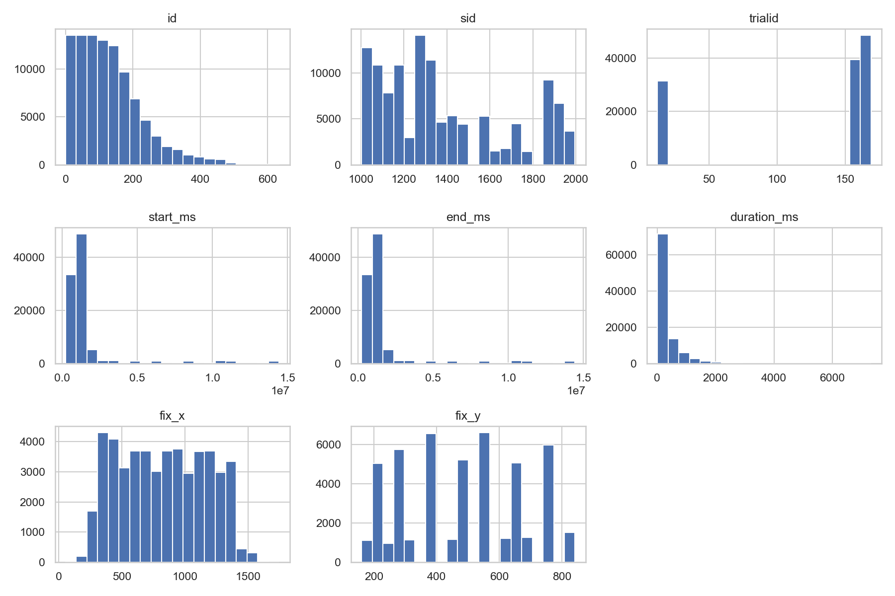
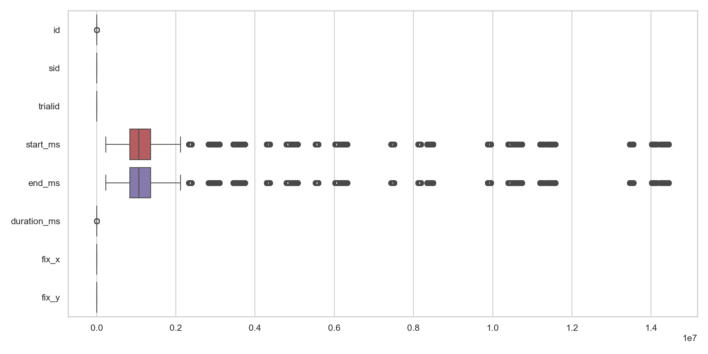
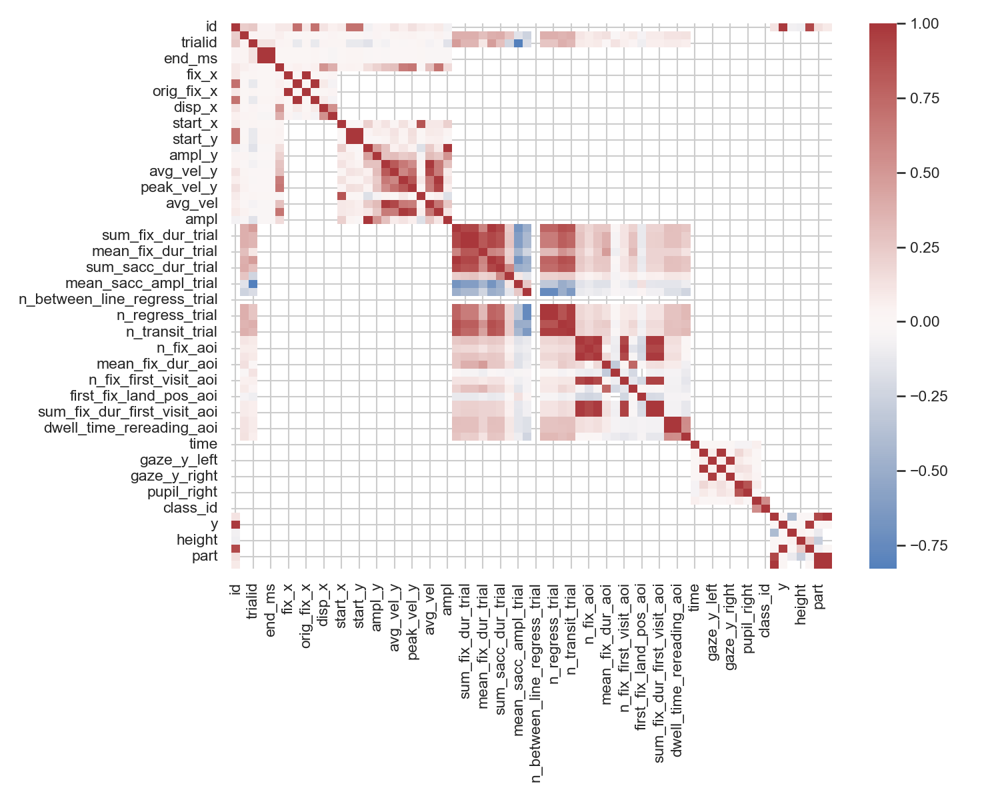
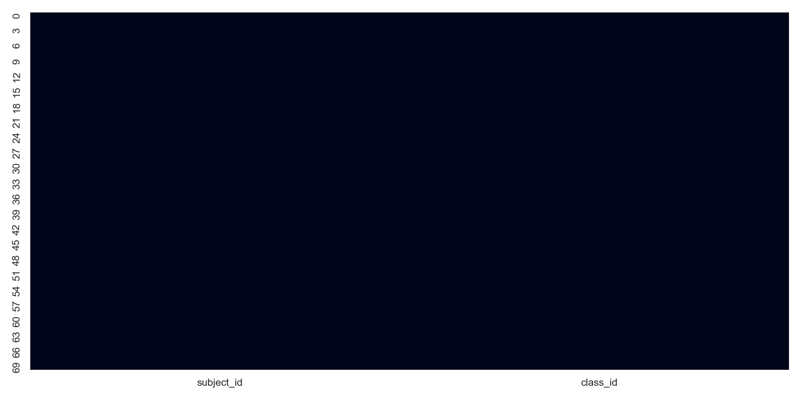
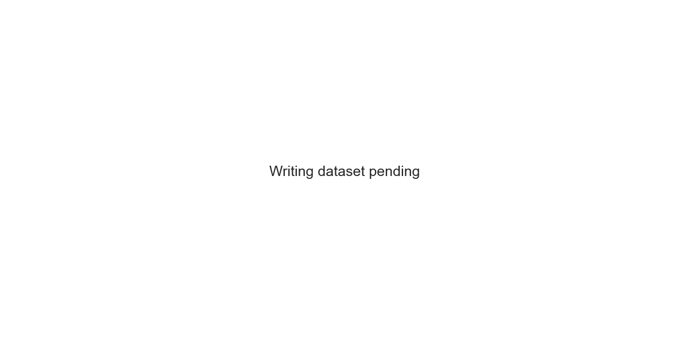
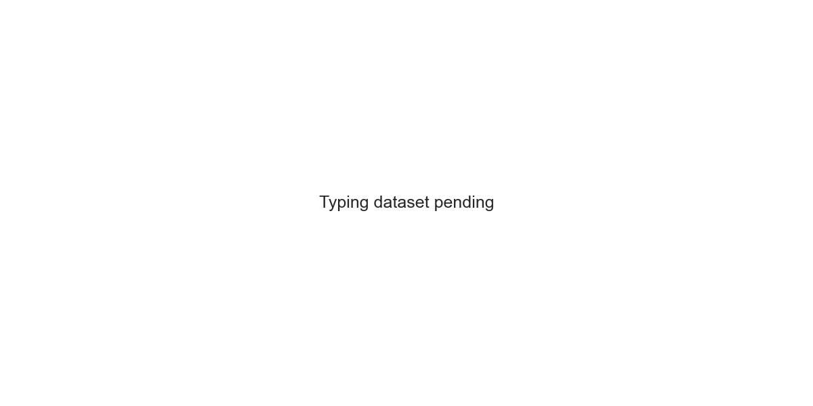

# DysLexAI Dataset Overview

DysLexAI is a multimodal dyslexia screening prototype. Phase 1 focuses on dataset ingestion, validation, exploratory analysis, and documentation. No machine learning models are trained in this phase.

## Dataset Summary

| Dataset | Purpose | Samples | Classes | Missing Values |
| --- | --- | ---: | ---: | ---: |
| ETDD70 Eye Tracking Dataset | Reading Behavior Analysis | 70 | 2 | 0 |
| Synthetic Dyslexia Handwriting Dataset | Handwriting Analysis | 0 | 0 | 0 |
| Typing Fluencies of Dyslexia Students and Peers | Typing Behavior Analysis | 0 | 0 | 0 |

## ETDD70 Eye Tracking Dataset

**Purpose:** Reading Behavior Analysis

**Source:** ETDD70 files under datasets/reading/

### Class Distribution

| Class | Count |
| --- | ---: |
| non-dyslexic | 35 |
| dyslexic | 35 |

### Feature Description

Detected fields include: subject_id, class_id, label, source_file.

### Potential Predictive Features

Fixation duration, saccade amplitude, regressions, gaze path stability, reading time, and blink-related features may become predictive indicators.

### Data Quality Observations

- Unexpected file extension for data.zip.
- Unexpected file extension for fixation_images.zip.
- Unexpected file extension for README.md.
- Unexpected file extension for rois.zip.
- Unexpected file extension for stimuli.zip.
- Unexpected file extension for 13332134.zip.

### Figures

### Summary Statistics

| feature | mean | median | std | min | max |
| --- | ---: | ---: | ---: | ---: | ---: |
| subject_id | 1350.8857 | 1272.5000 | 286.7826 | 1003.0000 | 1996.0000 |
| class_id | 0.5000 | 0.5000 | 0.5036 | 0.0000 | 1.0000 |

### Interpretation

The reading dataset contains 70 samples. The Phase 1 checks produced 6 warning(s), which should be reviewed before model development begins.

## Synthetic Dyslexia Handwriting Dataset

**Purpose:** Handwriting Analysis

**Source:** Place handwriting image folders under datasets/writing/

### Class Distribution

No class labels were detected for this dataset.

### Feature Description

Feature names are unavailable until dataset files are added.

### Potential Predictive Features

Stroke shape, character spacing, slant, baseline drift, symbol deformation, and texture descriptors may become predictive image features.

### Data Quality Observations

- Unexpected file extension for Dataset Dyslexia_Password WanAsy321.rar.
- Unexpected file extension for archive.zip.
- No readable handwriting image files were found.

### Figures

### Interpretation

The dataset has not yet been placed in the repository. The pipeline is ready to validate and analyze it once files are added to the configured folder.

## Typing Fluencies of Dyslexia Students and Peers

**Purpose:** Typing Behavior Analysis

**Source:** Place keystroke logs under datasets/typing/

### Class Distribution

No class labels were detected for this dataset.

### Feature Description

Feature names are unavailable until dataset files are added.

### Potential Predictive Features

Key hold time, flight time, pause duration, correction rate, session duration, and event rhythm may become predictive behavioral features.

### Data Quality Observations

- No dataset files were found in the expected directory.
- No readable tabular records were loaded.

### Figures

### Interpretation

The dataset has not yet been placed in the repository. The pipeline is ready to validate and analyze it once files are added to the configured folder.
